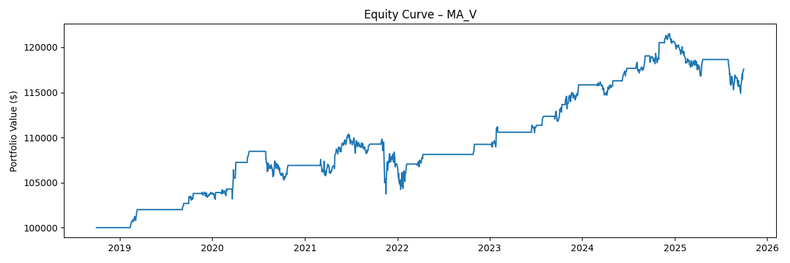
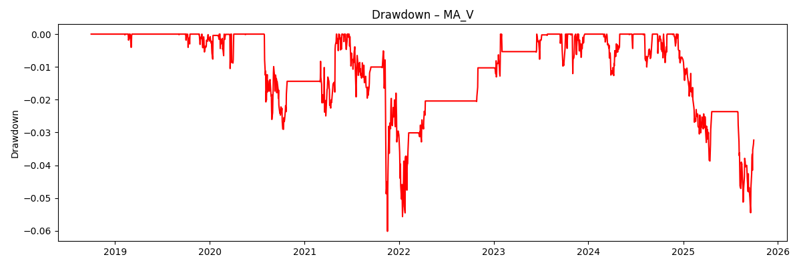
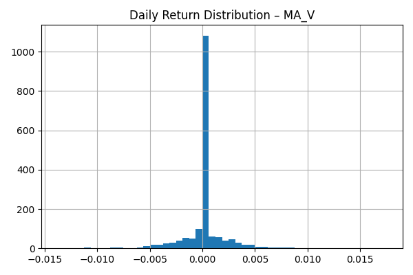
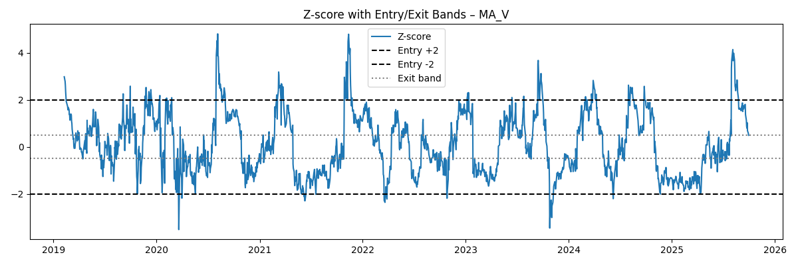

# Pairs Trading Algorithmic Strategy – Statistical Arbitrage Engine

**Author:** Ainesh Basu

A research project implementing a **mean-reversion pairs trading strategy**
on US equities using daily price data. The engine discovers cointegrated
pairs, builds a hedged spread, and runs both **backtests** and
**paper-trading simulations** with transaction costs, risk controls, and
performance reporting.

---

## Features

- **Data pipeline**

  - Clean daily adjusted close prices into a tidy `adj_close_clean.csv`.
  - Support for multiple equity pairs (e.g. `MA_V`, `KO_PEP`, `XOM_CVX`, `JPM_BAC`).

- **Hedge ratio & spread construction**

  - OLS regression to estimate hedge ratio **β** between the two legs.
  - Spread = (Y − βX) with rolling mean / standard deviation.

- **Signal generation**

  - Rolling z-score of the spread.
  - Entry / exit bands (e.g. enter at |z| ≥ 2, exit near 0).
  - Signals stored per pair in `data/processed/signals_<PAIR>.csv`.

- **Backtesting engine**

  - Uses position series from signals to build a synthetic P&L.
  - Includes per-trade transaction costs.
  - Computes equity curve, annualized return, volatility, Sharpe ratio, and max drawdown.

- **Paper trading engine (offline replay)**

  - Replays the entire price history one day at a time.
  - Trades via a simple `PaperBroker` with cash, positions, and trade log.
  - Risk-based position sizing using a `risk_frac` of current equity.
  - Tracks total fees paid and exports `paper_results_<PAIR>.csv`.

- **Visualization & reporting**
  - Equity curve plot.
  - Drawdown curve.
  - Daily return distribution histogram.
  - Z-score with entry / exit bands.
  - All plots saved to `data/processed/*.png`.

---

## Requirements

- Python **3.11**
- `pip` (or `pipx`)
- (Recommended) `venv` / virtualenv

---

## Project Structure

```text
pairs-trading/
├─ .venv/                  # Virtual environment (ignored by git)
├─ config/
│  ├─model.yaml            # Chosen MA_V configuration (window, entry/exit, risk frac, transaction cost etc.)
│  ├─backtest.yaml         # Backtesting settings (tested pairs, data path, result files)
│  ├─base.yaml    
│  ├─data.yaml             # Data source config. (provider, tickers, start/end date etc.)
│  ├─risk.yaml
├─ data/
│  ├─ raw/                 # Raw untouched market data
│  │  └─ adj_close.csv     # Adjusted close prices for all tickers (downloaded input)    
│  ├─ interim/             # Intermediate cleaned data used for feature generation
│  │  └─ adj_close_clean.csv  # Aligned + filtered daily prices (removes missing dates, bad rows)
│  └─ processed/                      # Generated results                   
│     ├─ hedge_results_<PAIR>.csv     # OLS hedge ratio + spread series per pair
│     ├─ signals_<PAIR>.csv           # Trading signals (+1: long the spread, -1: short the spread, 0: no position)(entry/exist positions)
│     ├─ backtest_results_<PAIR>.csv  # Backtest performance results for each tested pair
│     ├─ paper_results_<PAIR>.csv     # "Paper Trading" logs
│     └─ plots (*.png)                # strategy equity curve, max drawdown, daily return distribution, Z-score with entry/exit markers plots
├─ src/
│  ├─ backtest/
│  │  └─ backtest.py       # Backtesting engine
│  ├─ data/
│  │  ├─ clean.py          # Build adj_close_clean.csv
│  │  ├─ loader.py         # Load raw price data 
│  ├─ features/
│  │  ├─ hedge_ratio.py    # Estimate hedge ratio & spread
│  │  └─ signals.py        # Rolling z-score & position signals
│  ├─ live/
│  │  └─ paper_engine.py   # Paper trading engine
│  ├─ plots/
│  │  └─ plot_paper_results.py  # Equity / DD / returns / z-score plots
│  ├─ __init__.py
│  └─ cli.py               # CLI (project expansion)
├─ .env.example
├─ pyproject.toml / requirements.txt
└─ README.md
```

## Setup

1. Create and activate virtualenv

```text
python3 -m venv .venv
source .venv/bin/activate      # Windows: .venv\Scripts\activate
```

2. Install dependencies

```text
pip install -r requirements.txt
```

(If you ever see import / version issues, re-activate the venv and
re-install dependencies.)

## Usage

Below is the typical workflow for a single pair.
Repeat the same steps for each pair you want to test (e.g. MA_V,
KO_PEP, XOM_CVX, JPM_BAC).

1. Build clean price history

```text
python -m src.data.clean
```

This creates data/interim/adj_close_clean.csv with aligned daily prices
for all tickers.

2. Estimate hedge ratio & spread for a pair

Example for MA_V:

```text
python -m src.features.hedge_ratio --pair MA_V
```

This writes data/processed/hedge_results_MA_V.csv containing:

- Y and X prices,
- the estimated hedge ratio \( \beta \),
- the spread series.

3. Generate trading signals

```text
python -m src.features.signals \
  --pair MA_V \
  --window 90 \
  --entry-z 2.0 \
  --exit-z 0.5
```

This creates signals_MA_V.csv with the rolling z-score, entry/exit
signals, and resulting position series.

4. Run backtest

```text
python -m src.backtest.backtest --pair MA_V
```

Outputs backtest_results_MA_V.csv and prints a performance summary:
total return, annualized return, volatility, Sharpe, and max drawdown.

5. Run paper-trading replay (with transaction costs)
   The best configuration found for MA_V in this project:

```text
python -m src.live.paper_engine \
 --pair MA_V --cash 100000 \
 --risk-frac 0.7 --window 90 \
 --entry-z 2.0 --exit-z 0.5
```

This creates paper_results_MA_V.csv and logs:

- Total return
- Annualized return / vol
- Sharpe ratio
- Max drawdown

Total fees paid (using a small per-trade cost)

6. Plot results

```text
python -m src.plots.plot_paper_results --pair MA_V
```

This generates four main figures in data/processed/:

- equity_MA_V.png – portfolio equity curve
- drawdown_MA_V.png – running drawdown
- returns_hist_MA_V.png – daily return distribution
- zscore_MA_V.png – z-score with entry/exit bands

## Performance Summary

All numbers below are after transaction costs with $100k starting
capital, using the signal / risk configuration in config/model.yaml.

```text
Pair      Window  Entry Z  Exit Z  Risk frac  Total Return  Ann. Return  Ann. Vol  Sharpe  Max DD
MA_V      90      2.0      0.5     0.7        17.60%        2.42%        3.56%     0.68    -6.01%
KO_PEP    90      2.0      0.5     0.7        -11.07%       -1.54%       5.15%     -0.30   -15.28
XOM_CVX   90      2.0      0.5     0.7        16.23%        2.50%        7.86%     0.32    -16.71
JPM_BAC   90      2.0      0.5     0.7        10.25%        1.57%        5.60%     0.28    -10.68
```

The table is meant to show that the strategy was tested on multiple
equity pairs, not just a single example.

MA_V vs other pairs

On the same historical period and using consistent transaction costs,
the MA_V (Mastercard / Visa) pair produced the most attractive
risk-adjusted performance:

- ~17.6% total return on $100k with annualized ~2.4%,
- annualized volatility ~3.6%,
- Sharpe ratio ≈ 0.68,
- maximum drawdown around –6%,
- roughly $936 in total trading fees.

Other tested pairs (KO/PEP, XOM/CVX, JPM/BAC) were profitable or close
to break-even but generally showed either lower Sharpe ratios or larger
drawdowns for similar return levels, so MA_V is the “production” pair
used in the main plots.

## 📈 Strategy Performance Charts (MA_V)

<div style="display: flex; gap: 12px;">

  <div style="flex: 1; text-align: center;">
    <strong>Equity Curve</strong><br>
    
  </div>

  <div style="flex: 1; text-align: center;">
    <strong>Drawdown</strong><br>
    
  </div>

</div>

---

<div style="display: flex; gap: 12px;">

  <div style="flex: 1; text-align: center;">
    <strong>Daily Return Distribution</strong><br>
    
  </div>

  <div style="flex: 1; text-align: center;">
    <strong>Z-Score with Entry/Exit Bands</strong><br>
    
  </div>

</div>

## Reproducibility

To reproduce the main MA_V results used in this repo:

1. Clone the repository and set up the virtual environment.
2. Run:

```text
python -m src.data.clean
python -m src.features.hedge_ratio --pair MA_V
python -m src.features.signals --pair MA_V --window 90 --entry-z 2.0 --exit-z 0.5
python -m src.backtest.backtest --pair MA_V
python -m src.live.paper_engine --pair MA_V --cash 100000 --risk-frac 0.7 --window 90 --entry-z 2.0 --exit-z 0.5
python -m src.plots.plot_paper_results --pair MA_V
```

3. Open the generated PNGs in data/processed/ to inspect equity, drawdown,
   return distribution, and z-score behaviour.

## License

MIT
